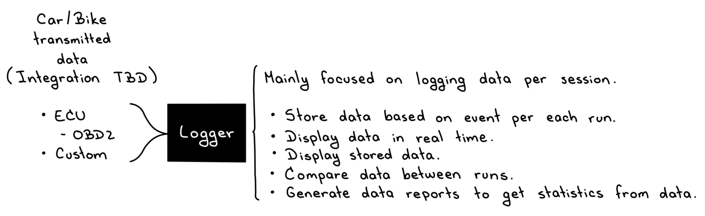

# Road to the Race - Telemetry logger

A telemetry system according to the following schematic of the MVP (minimum viable product):



While the data to be inputted needs to be integrated within the system (so it is actually transmitted to the software and therefore, logged), as a MVP we’ll be focusing exclusively on the software side of things with test data, so that the software is developed before the whole system is implemented.

### Dependencies

Be sure to install the following before execution:

- PNPM
- NPM

### Running the program

After cloning the repo, just make sure to run:

```
cd app
npm install .
npm run dev
```
